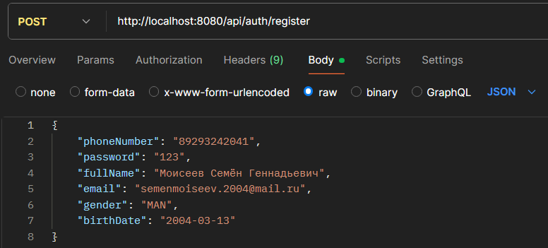

# Spring-project

Использовалось:
- Java 21
- Spring boot 3.3.11
- Postgresql 16

----------------------------------------------------------------------------
----------------------------------------------------------------------------

___ОСНОВНАЯ ЧАСТЬ___

Регистрация пользователя:
POST http://localhost:8080/api/auth/register

{
"phoneNumber": "89293242041",
"password": "123",
"fullName": "Моисеев Семён Геннадьевич",
"email": "semenmoiseev.2004@mail.ru",
"gender": "MAN",
"birthDate": "2004-03-13"
}

----------------------------------------------------------------------------

Получение баланса пользователя:
GET http://localhost:8080/api/user/balance

Authorization : Basic Auth

----------------------------------------------------------------------------

Оплата:
POST http://localhost:8080/api/payment

Authorization : Basic Auth

Headers:
Content-Type: application/json
Accept: application/json

{
"recipientPhone": "79991234567",
"amount": 10.12
}

----------------------------------------------------------------------------
----------------------------------------------------------------------------

___ДОПОЛНИТЕЛЬНАЯ ЧАСТЬ___

Одновление данных пользователя:
PATCH http://localhost:8080/api/user/me

Authorization : Basic Auth

Headers:
Content-Type: application/json

{
"fullName": "Моисеев Семён Геннадьевич",
"email": "semenmoiseev.2004@mail.ru",
"gender": "MAN",
"birthDate": "2004-03-13"
}

----------------------------------------------------------------------------

(Для удобства дополнительно сделал)
Вывод данных пользователя:
GET http://localhost:8080/api/user/me

Authorization : Basic Auth

----------------------------------------------------------------------------

Получение истории операций пользователя:
GET http://localhost:8080/api/transactions?page=0&size=10

Authorization : Basic Auth

Установлены значения параметров по умолчанию. Если не указывать параметры, выводится информация по 10 записей на страницу

----------------------------------------------------------------------------
----------------------------------------------------------------------------

Архитектура проекта:

- controller (Обрабатывает HTTP-запросы / возвращает JSON-ответы)
  - AuthController.java - Запросы для регистрации/входа, JSON-ответ
  - PaymentController.java - Оплата
  - TransactionController.java - Работа с историей платежей, вывод с пагинацией
  - UserController.java - Регистрация, обновление данных, проверка баланса

- dto (Соединяет клиента и сервер)
  - AuthRequest.java - Передает данные аутентификации между клиентом и сервером
  - BalanceResponse.java - Формирует ответ API с балансом пользователя
  - PaymentRequest.java - Формирует запрос API на оплату
  - PaymentResponse.java - Формирует ответ API после оплаты
  - TransactionResponse.java - Формирует ответ API с историей операций
  - UpdateUserRequest.java - Формирует запрос API на обновление данных пользователя
  

- entity (Сущности)
  - User.java - Описывает структуру данных пользователя в БД
  - Transaction.java - Описывает структуру данных транзакций и хранит историю платежей

- repository (Доступ к БД / SQL-запросы)
  - UserRepository.java - Генерация SQL-запросов для работы с таблицей users
  - TransactionRepository.java - Доступ данных из БД о транзакциях

- service (Логика)
  - PaymentService.java - Оплата, проверяет достаточность денег
  - TransactionService.java - Получение транзакции
  - UserService.java - Регистрация, обновление данных, проверка баланса

Схема работы компонентов:
